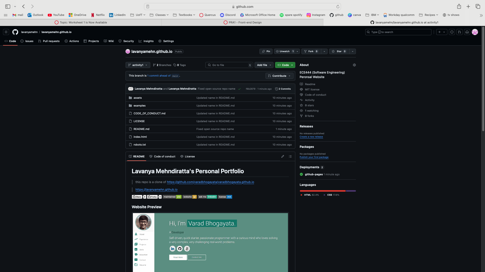
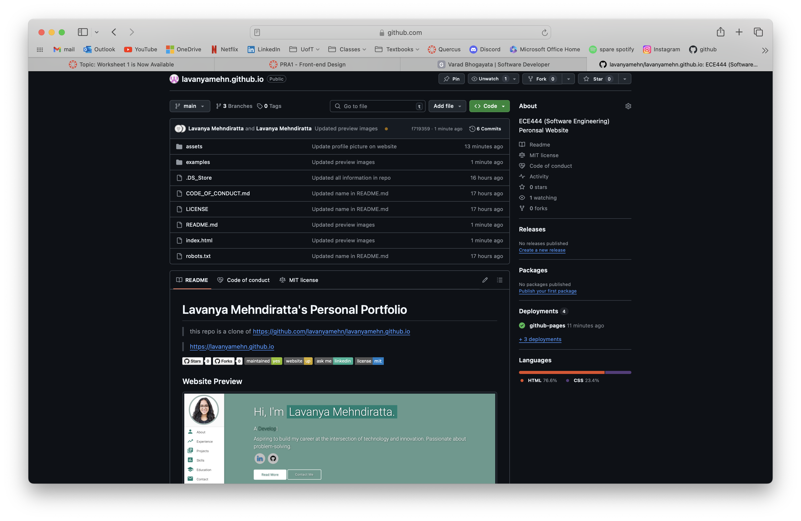
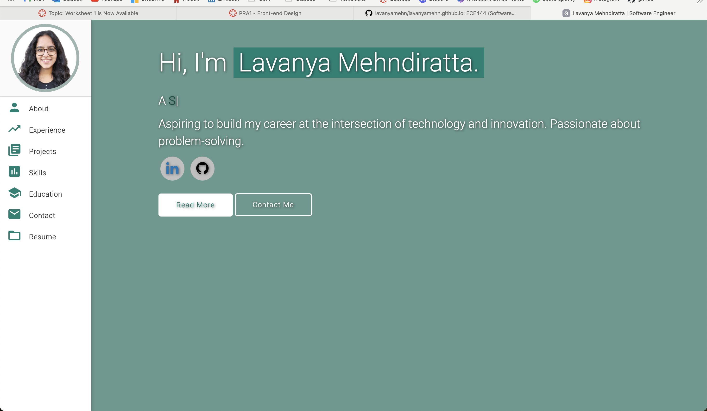
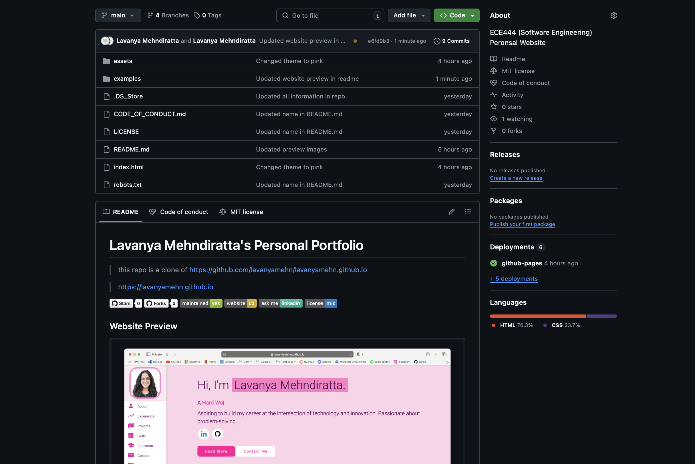
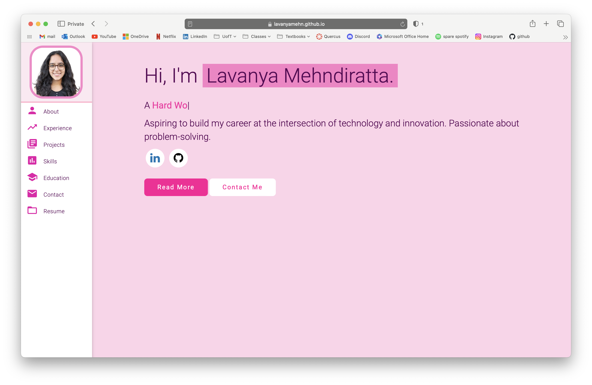
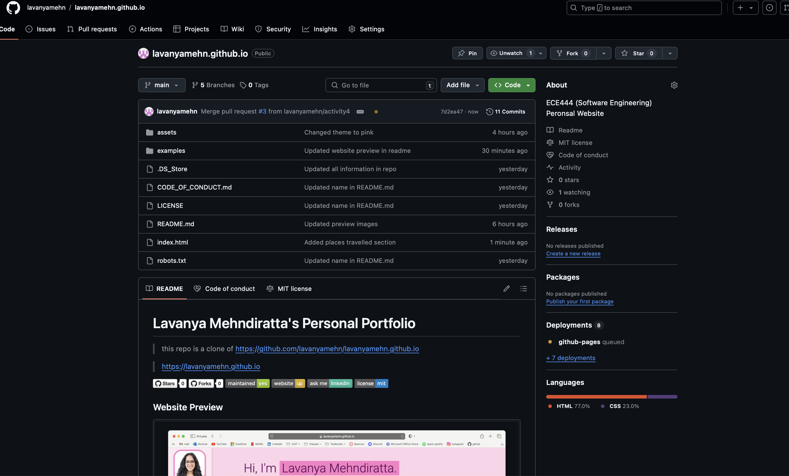
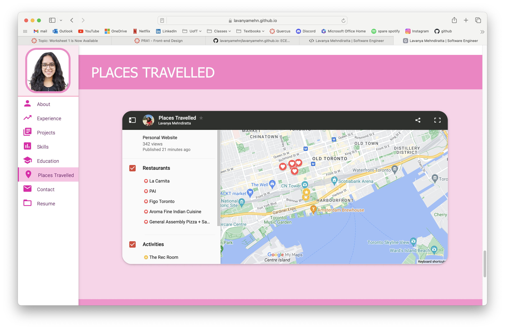
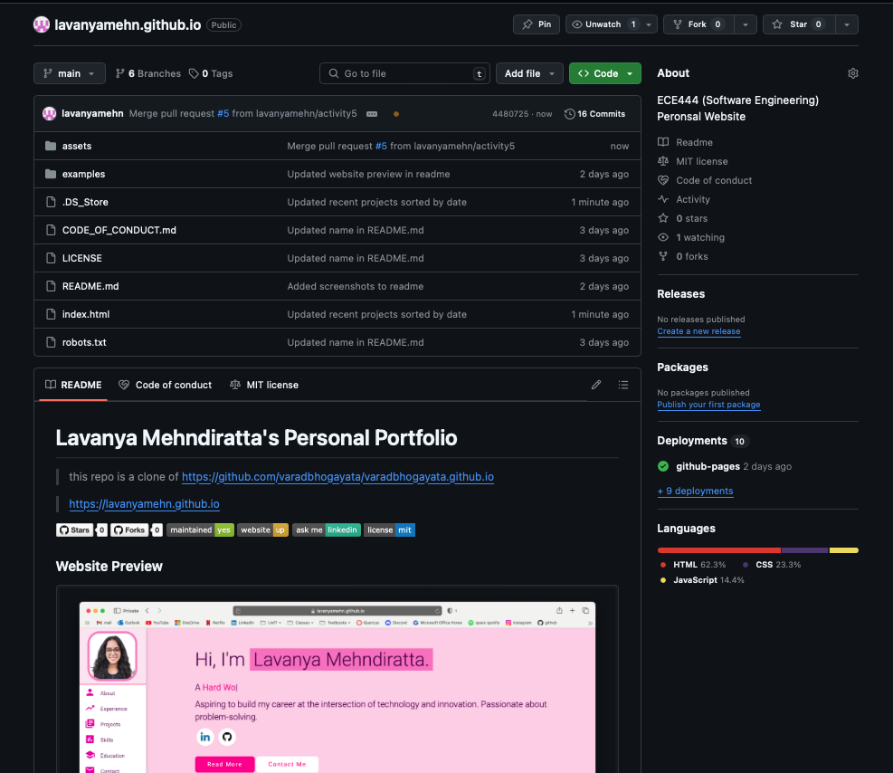
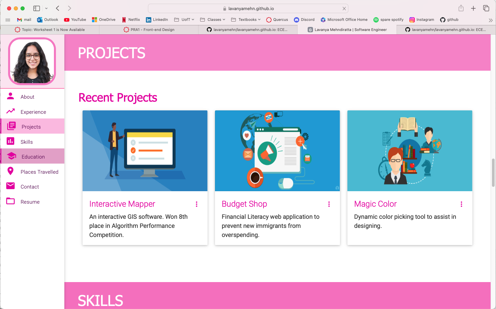

# Lavanya Mehndiratta's Personal Portfolio

> this repo is a clone of
https://github.com/varadbhogayata/varadbhogayata.github.io

> Access my website: https://lavanyamehn.github.io

 

### Website Preview

 
  <kbd>
    
  </kbd>

### Assignment Screenshots
##### Activity 1
- Clone repo

 
    

##### Activity 2
- Add personal information

 
    
    

##### Activity 3
- Change color theme

 
    
    

##### Activity 4
- Add google maps

 
    
    

##### Activity 5
- Make project section dynamic

 
    
    
    
After load more is clicked:

    

:star: Star me on GitHub — it helps!

## Features 📋
⚡️ Fully Responsive\
⚡️ Valid HTML5 & CSS3\
⚡️ Typing animation using `Typed.js`\
⚡️ Easy to modify

## Installation & Deployment 📦
- Clone the repository and modify the content of <b>index.html</b> according to your requirement.
- Add or remove images from `lavanyamehn.github.io/assets/img/` directory as per your requirement.
- I highly recommend to use [Github Pages](https://create-react-app.dev/docs/deployment/#github-pages) to deploy the website the EASIEST WAY.
- To deploy your website, first you need to create github repository with name `<your-github-username>.github.io`. Please don't give any other name.
- Push the generated code to the `master` branch of this repository.
- <b>NOTE:</b> Make sure to set `analyticsId` from your Google Analytics account inside the Google Analytics script tag, if you want to use your own Google Analytics account.

## Sections 📚
✔️ About me\
✔️ Experience\
✔️ Projects \
✔️ Skills \
✔️ Education\
✔️ Contact Info\
✔️ Resume

To view a live example, **[click here](https://lavanyamehn.github.io/)**

## Tools Used 🛠️
* [<b>GitHub Pages</b>](https://create-react-app.dev/docs/deployment/#github-pages) - To host my static website (HTML, CSS, JS).
* [<b>Materialize</b>](https://materializecss.com/) - A CSS framework to get Google's Material Design components.
* [<b>Typed.js</b>](https://mattboldt.com/demos/typed-js/) - JavaScript Library

## Contributing 💡
#### Step 1

- **Option 1**
    - 🍴 Fork this repo!

- **Option 2**
    - 👯 Clone this repo to your local machine.

#### Step 2

- **Build your code** 🔨🔨🔨

#### Step 3

- 🔃 Create a new pull request.

## License 📄
This project is licensed under the MIT License - see the [LICENSE.md](./LICENSE) file for details.

## References
### Projects:
[1] Pngtree.com, 2024. https://png.pngtree.com/element_our/sm/20180410/sm_5acd1797b5783.jpg (accessed Sep. 19, 2024).
[2] Wisc.edu, 2024. https://fyi.extension.wisc.edu/moneymatters/files/2022/07/Untitled-design-1024x692.png (accessed Sep. 19, 2024).
[3] Googleapis.com, 2024. https://storage.googleapis.com/gweb-uniblog-publish-prod/images/google_maps_helpful_hero_1.width-1200.format-webp.webp (accessed Sep. 19, 2024).
[4] “Newest Vector Art, Graphics, & Images,” Vecteezy. https://www.vecteezy.com/vector-art/523631-crayon-background-colorful-pencil-seamless-border-pattern
